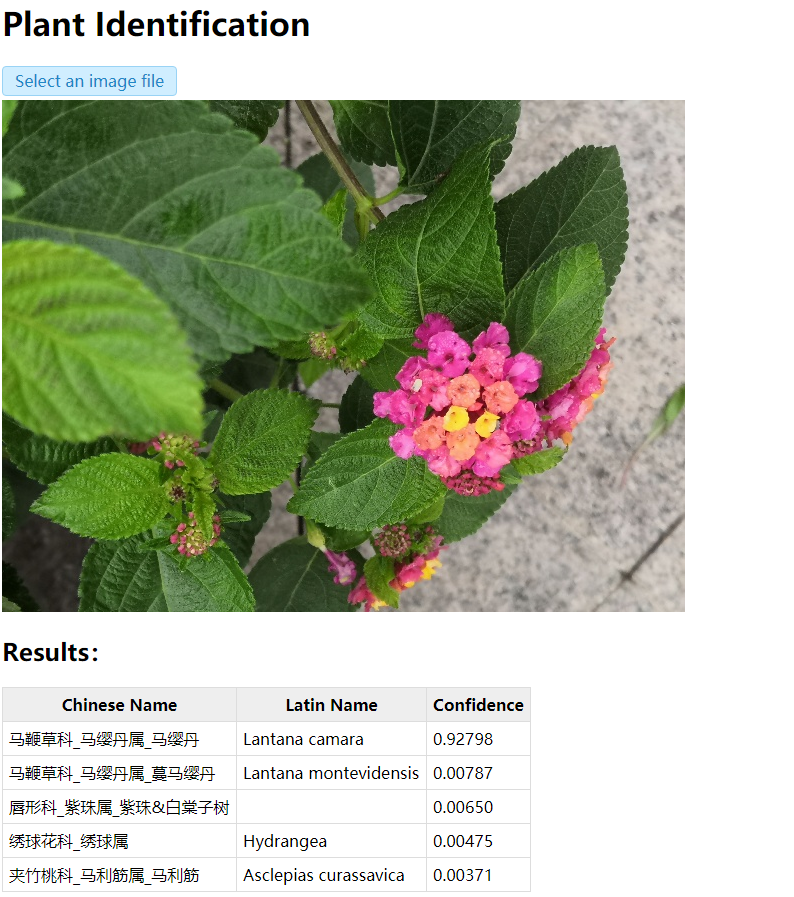

# Features
- Identify 2759 plant taxa (maybe genus, species, subspecies, variety, etc.).
- Model size is 55.4M; top1/top5 accuracy is 89.0%/97.1%.
- Open-source model, easy-to-use interface.
- Update continuously.

# Installation
You need install Anaconda, then run below:
```
git clone https://github.com/quarrying/quarrying-plant-id.git
cd quarrying-plant-id
conda create -n plantid python=3.6 -y
conda activate plantid
pip install -r requirements.txt
```

# Usage 

## Method I: Python Interface
```python
import plantid

plant_identifier = plantid.PlantIdentifier()
image = plantid.imread_ex(image_filename)
outputs = plant_identifier.identify(image, topk=5)
if outputs['status'] == 0:
    print(outputs['results'])
else:
    print(outputs)
```
You can also see [demo.py](<demo.py>).

## Method II: Web App
Run below
```
cd webapp
conda activate plantid
python app.py
```
Then open <http://127.0.0.1:5000/>, and upload an image file.


### Examples




# Details
See <https://zhuanlan.zhihu.com/p/364346303>.


# ChangeLog

- 20210905 Release model which supports 2759 plant taxa.
- 20210718 Release model which supports 2002 plant taxa.
- 20210609 Release model which supports 1630 plant taxa.
- 20210413 Release model which supports 1320 plant taxa.

