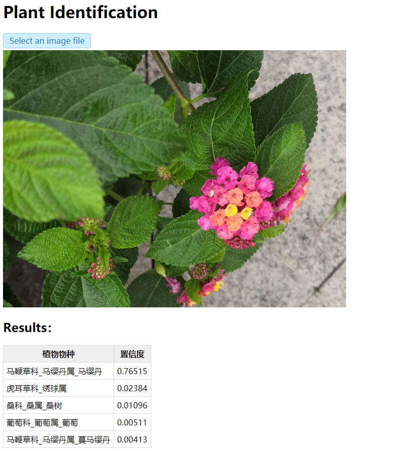
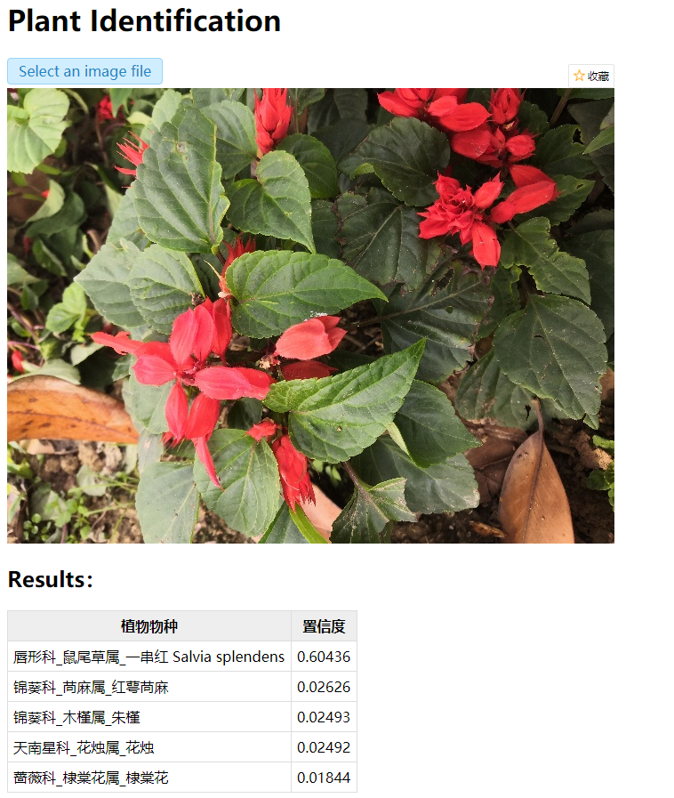
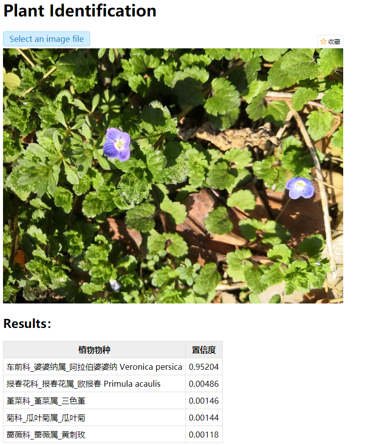
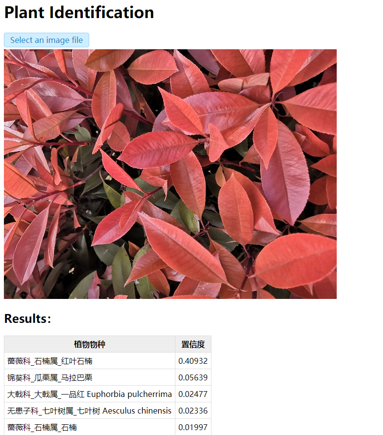

# Features
- Identify 1320 plant species.
- Model size: 51.8M; top1 accuracy: 90%+.
- Open-source model, easy-to-use interface.
- Update continuously.

# Installation
You need install Anaconda, then run below:
```
git clone https://github.com/quarrying/quarrying-plant-id.git
cd quarrying-plant-id
conda create -n plantid python=3.6 -y
conda activate plantid
pip install -r requirements.txt
```

# Usage 

## Method I: Python Interface
```python
import plantid

plant_identifier = plantid.PlantIdentifier()
probs, class_names = plant_identifier.predict(image_filename)
print(class_names[0], probs[0])
```
You can also see [tools/test.py](<tools/test.py>).

## Method II: Web App
Run below
```
cd webapp
conda activate plantid
python app.py
```
Then open <http://127.0.0.1:5000/>, and upload an image file.


### Examples








# Details
See <https://zhuanlan.zhihu.com/p/364346303>.

